## Panduan Mendaftar AWS Free Tier

### 1. Akses Situs Resmi AWS

Buka laman resmi AWS melalui:
[https://aws.amazon.com/id/](https://aws.amazon.com/id/)

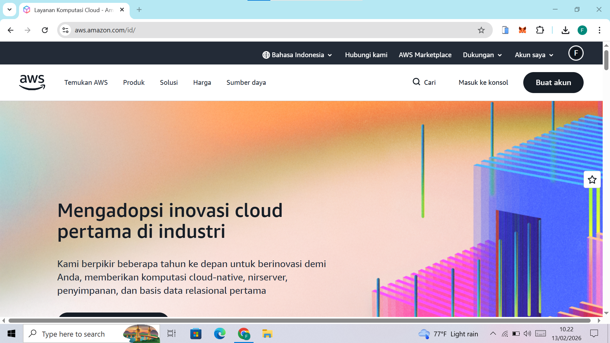

---

### 2. Pilih Menu **Create an AWS Account**

Klik tombol **Create an AWS Account** untuk memulai proses pendaftaran.

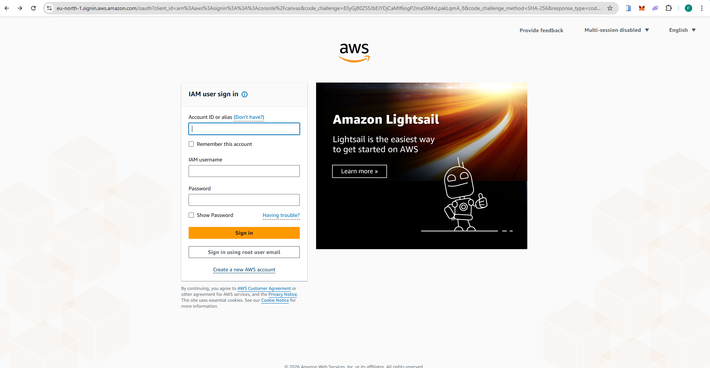

---

### 3. Masukkan Informasi Email dan Verifikasi

Isi alamat email yang aktif, kemudian masukkan kode verifikasi yang dikirimkan.

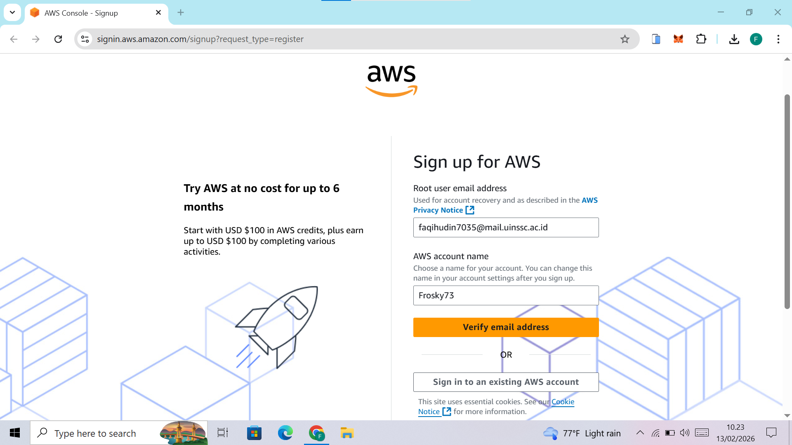
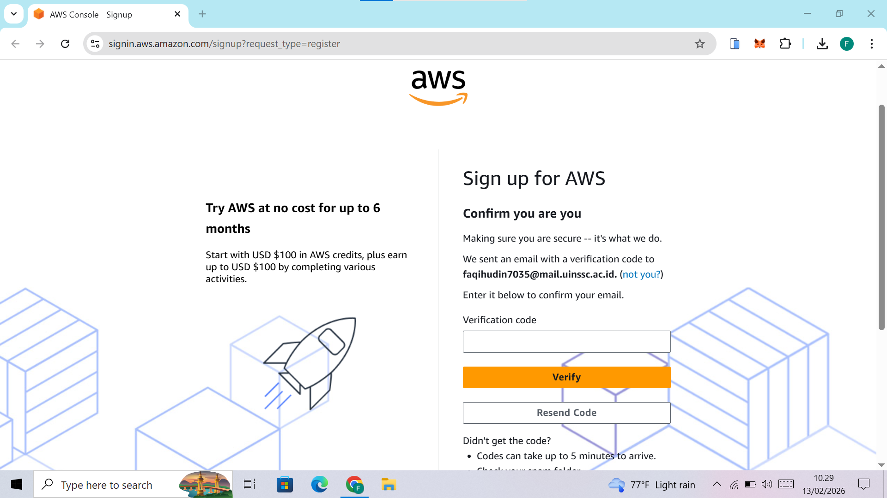

---

### 4. Buat Password yang Kuat

Buat password dengan kombinasi huruf besar, huruf kecil, angka, dan simbol untuk meningkatkan keamanan akun.

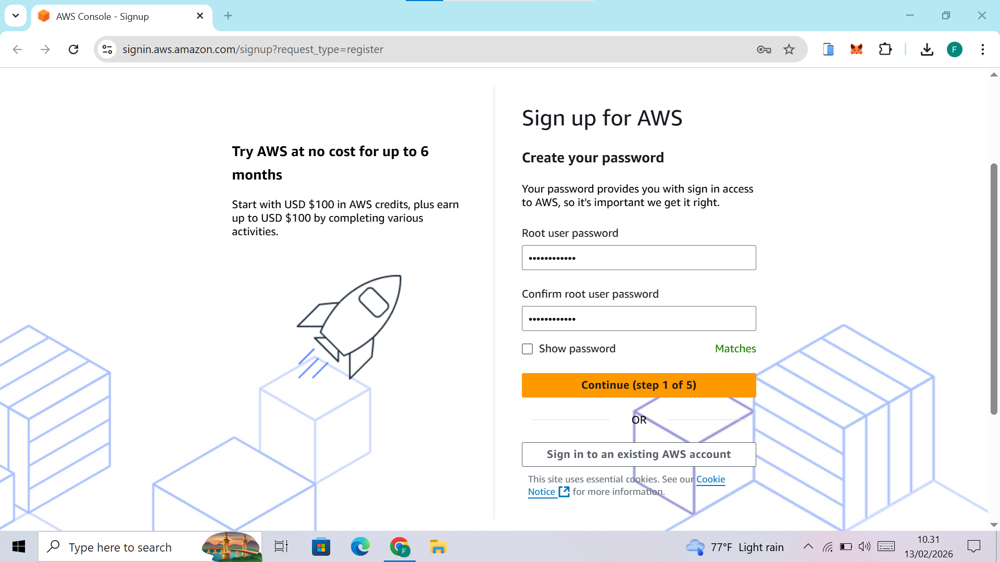

---

### 5. Pilih Opsi Free Tier

Pilih opsi **Free Tier** untuk menggunakan layanan gratis AWS sesuai ketentuan yang berlaku.

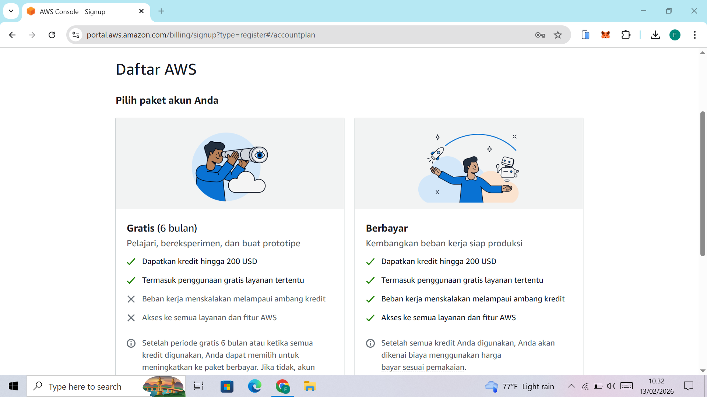

---

### 6. Isi Informasi Kontak Pribadi

Lengkapi data pribadi sesuai dengan identitas yang valid.

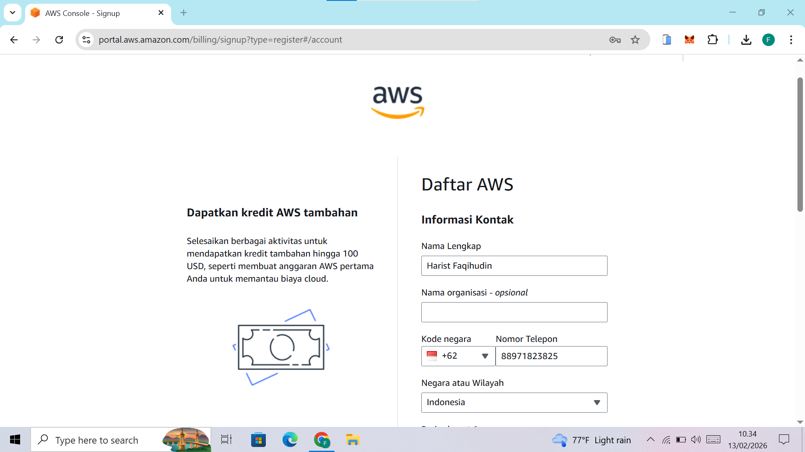

---

### 7. Masukkan Informasi Kartu Kredit/Debit

Isi data kartu yang akan digunakan untuk verifikasi pembayaran.

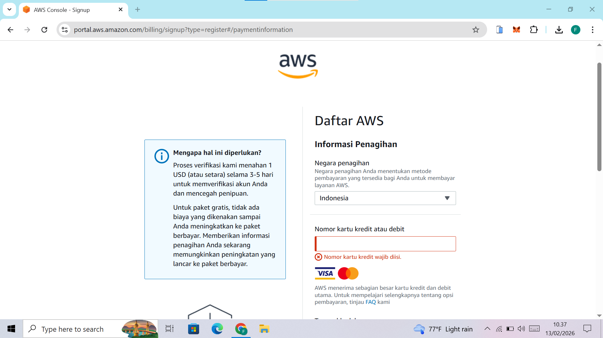

---

### 8. Konfirmasi Metode Pembayaran

Lakukan konfirmasi tagihan sesuai instruksi yang diberikan.

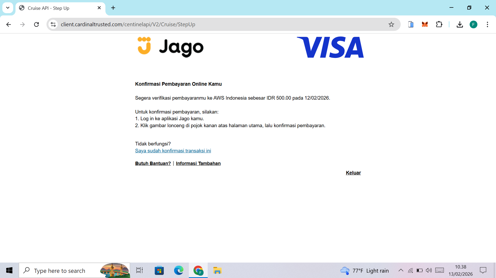
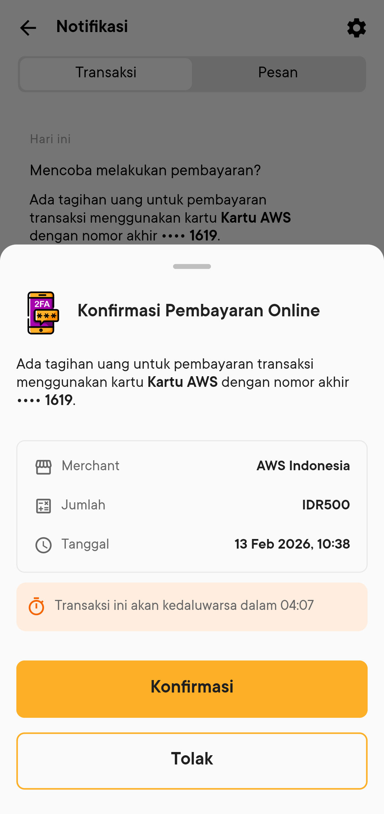

---

### 9. Verifikasi Melalui SMS

AWS akan mengirimkan kode verifikasi melalui SMS ke nomor yang telah didaftarkan. Masukkan kode tersebut untuk menyelesaikan proses verifikasi.

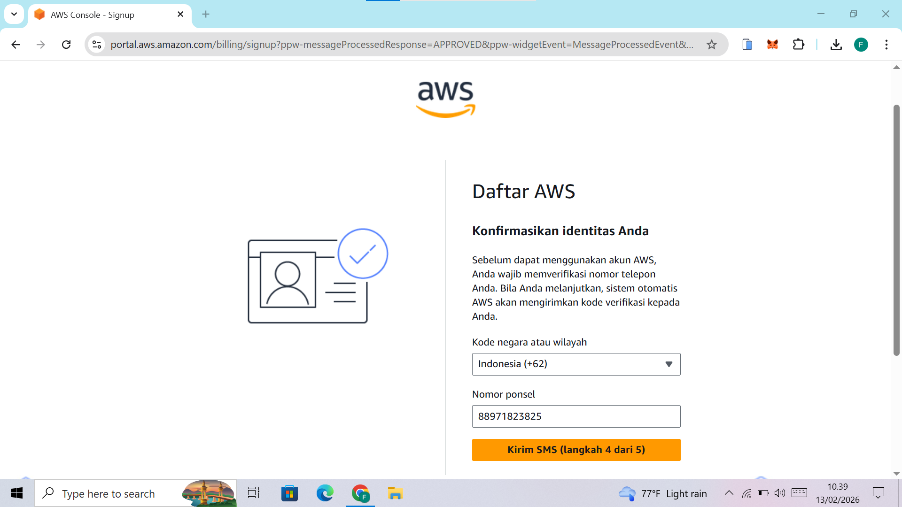

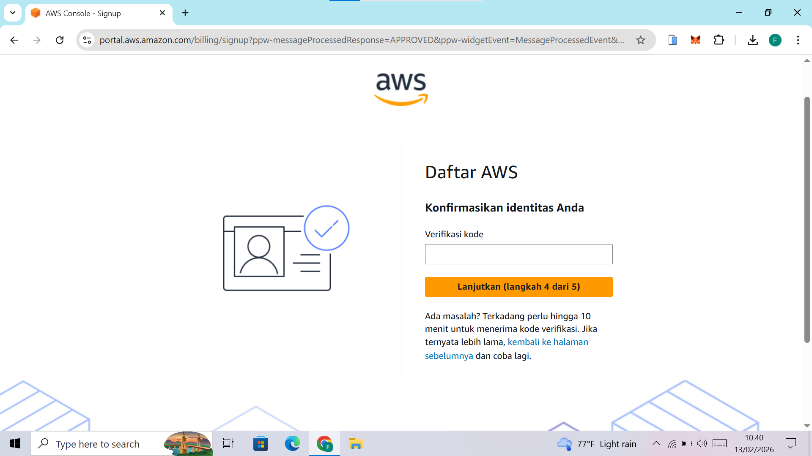

---

### 10. Akun Berhasil Dibuat

Jika seluruh proses selesai, akun AWS Free Tier berhasil dibuat dan siap digunakan.

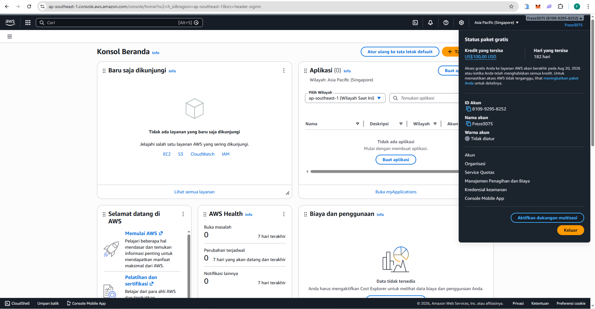
