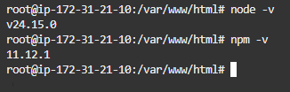
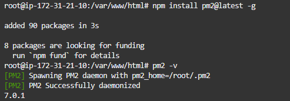
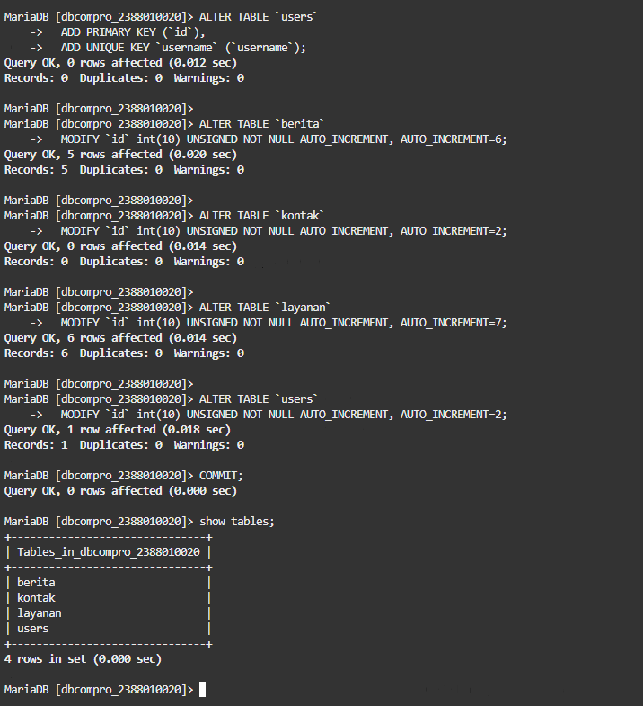
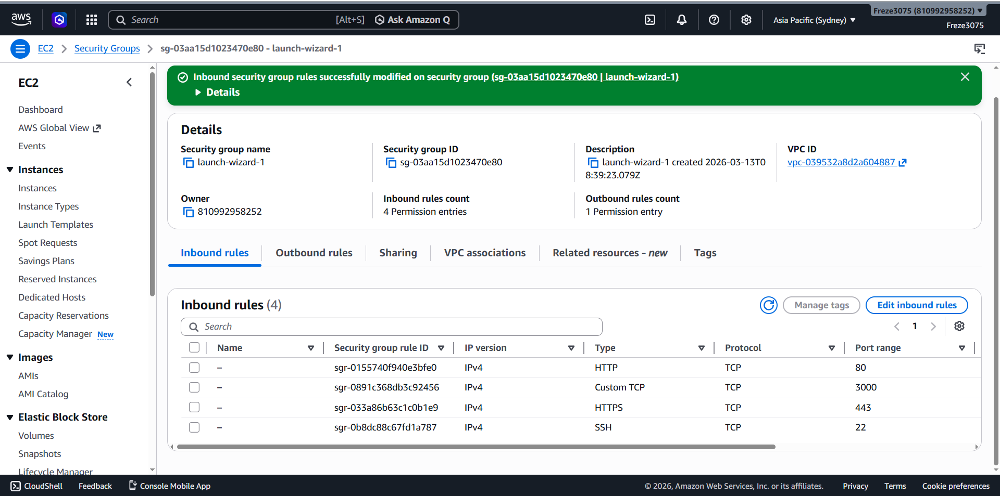
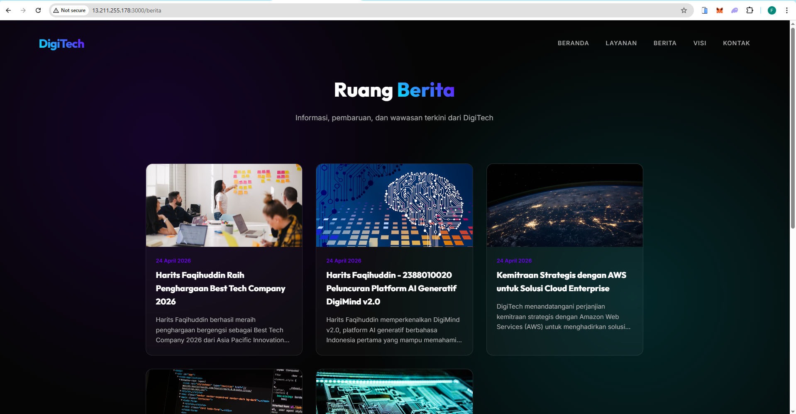

# Migration Standalone Folder to Instance AWS EC2

1. Upload `standalone.zip` via SFTP (FileZilla)
2. Konek via SSH → `ssh -i nama_file.pem ubuntu@[IP_ADDRESS]` / PuTTY
   - Patching OS → `sudo apt update && sudo apt upgrade`
3. Install `unzip` → `sudo apt install unzip -y`
4. `cd /var/www/html`
5. Extract file → `unzip standalone.zip`
6. Cek hasil extract → `ls -R` / cek via FileZilla
7. Install interpreter untuk aplikasi berbasis Node.js sesuai dokumentasi resmi
   https://nodejs.org/en/download
   - `curl -o- https://raw.githubusercontent.com/nvm-sh/nvm/v0.40.4/install.sh | bash`
   - `source ~/.bashrc`
   - `nvm install 24`
   - Verifikasi versi Node.js:
     - `node -v`
   - Verifikasi versi npm:
     - `npm -v`

   

   - Install PM2 untuk session management → `npm install pm2@latest -g`
   - `pm2 -v`

   

8. Export – Import Database
   - Jalankan DBMS (Laragon, XAMPP, dll.)
   - Export `db_compro`
   - Hapus `ENGINE=InnoDB DEFAULT CHARSET=utf8mb4 COLLATE=utf8mb4_0900_ai_ci`
   - Login sebagai `usrcompro_NIM`
   - `use dbcompro_NIM;`
   - Copy-paste query (Ctrl+A dari file SQL hasil export) → klik kanan di terminal AWS untuk paste
   - `show tables;`

   

9. Sesuaikan file `.env`
   - `cd standalone`
   - `sudo nano .env`
   - Sesuaikan isi `.env`:
     ```
     DB_HOST=[IP_ADDRESS]
     DB_USER=usrcompro_NIM
     DB_PASS=[PASSWORD]
     DB_NAME=dbcompro_NIM
     ```
   - Simpan → `Ctrl+X` → `Y` → `Enter`

10. Jalankan aplikasi → `pm2 start server.js`
11. Tambahkan / buka port `3000` di AWS Security Groups

    

12. Akses aplikasi → `http://[IP_ADDRESS]:3000`
13. Akses panel admin → `http://[IP_ADDRESS]:3000/admin`, edit berita ke-2, tambahkan nama dan NIM

    