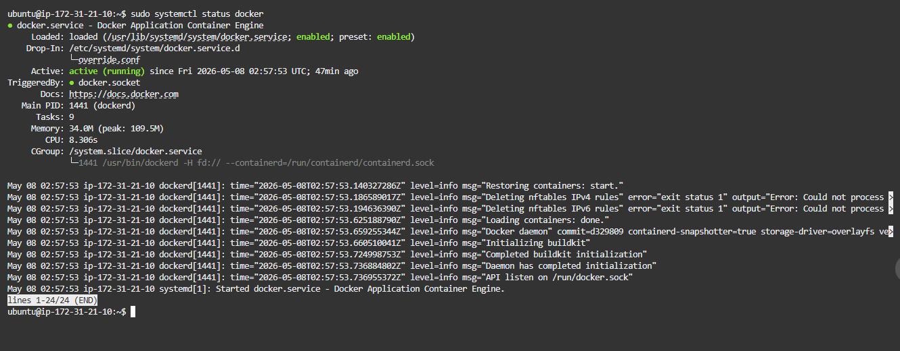
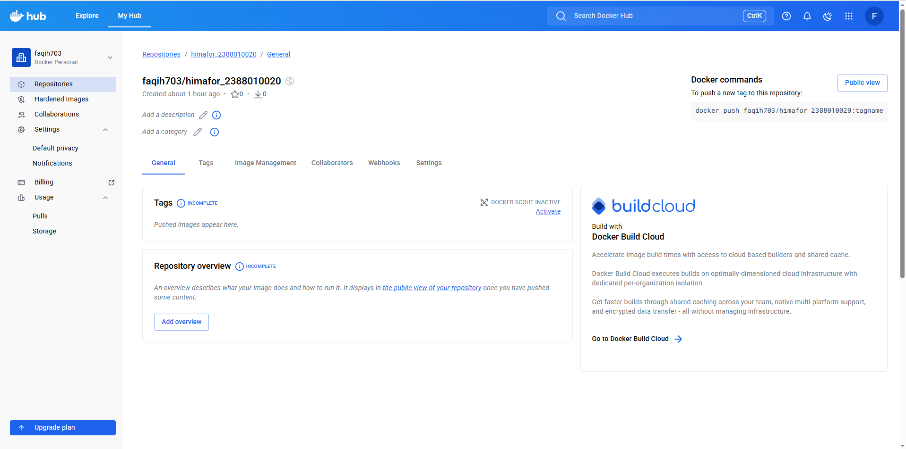
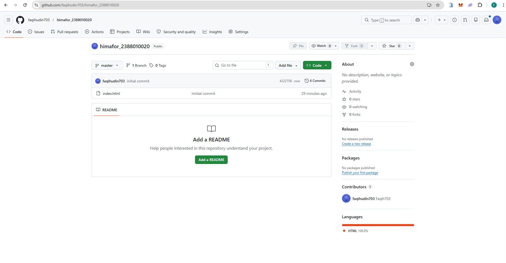
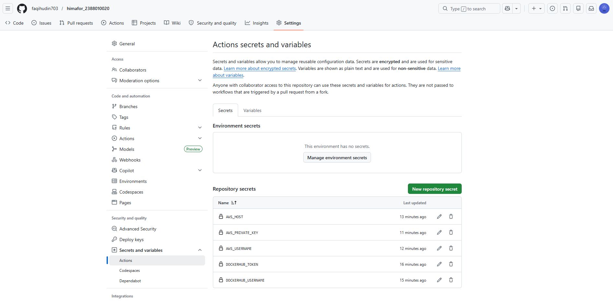
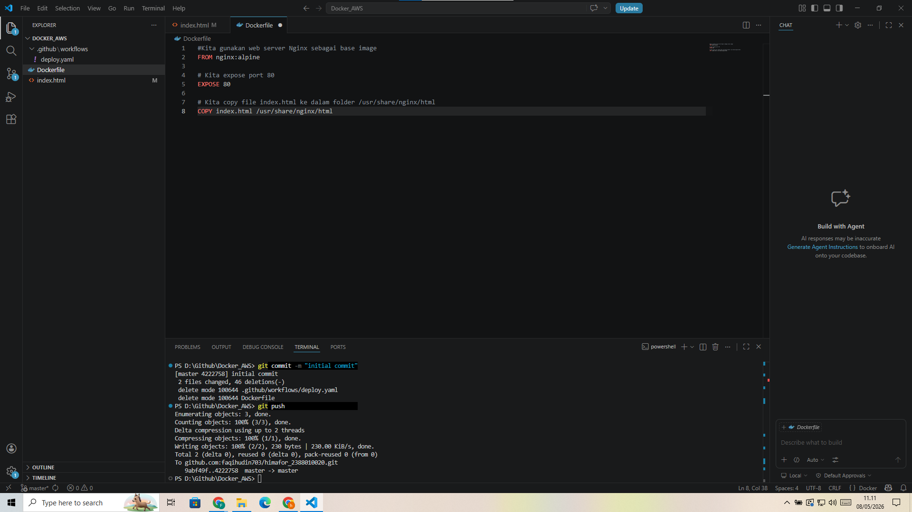
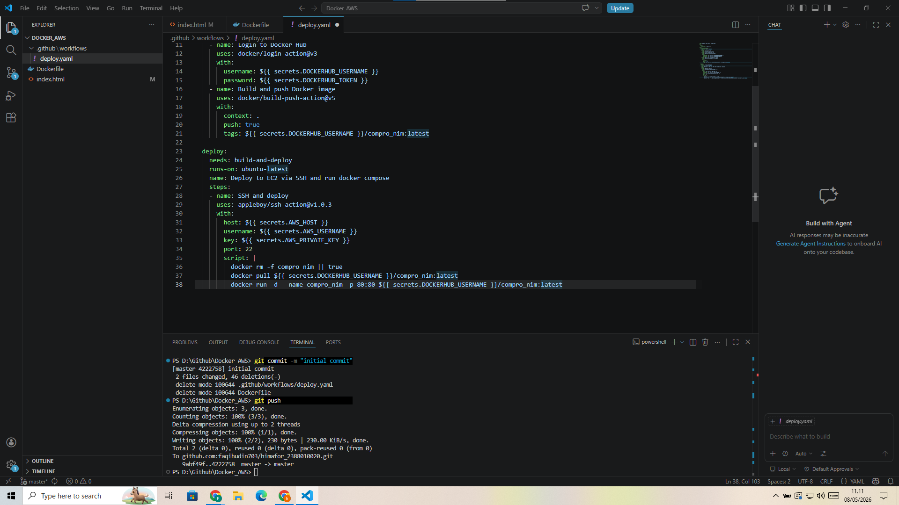
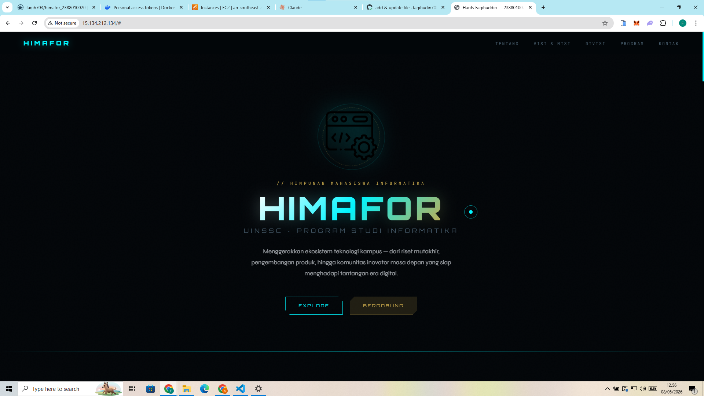

# CI/CD dengan Git -> Github Actions -> Docker Hub -> EC2 AWS

1. **Start Instance di AWS EC2**

2. **Patching OS**
   ```
   sudo apt update && sudo apt upgrade
   ```

3. **Install Docker di EC2 AWS** https://docs.docker.com/
   - Uninstall versi Docker lama
     ```
     sudo apt remove $(dpkg --get-selections docker.io docker-compose docker-compose-v2 docker-doc podman-docker containerd runc | cut -f1)
     ```
   - Konfigurasi Apt repository Docker
   - Install Docker Engine
   - Verifikasi Docker berjalan → `systemctl status docker`
   

4. **Buat Repository di Docker Hub** https://hub.docker.com/
   - Daftarkan akun dan masuk
   - Buat repository baru → (Hub → Repositories → New)
   - Generate Access Token → Klik Profile → Account Settings → Security → Access Tokens → Generate new token
   - Simpan token di tempat aman
   

5. **Buat Repository di Github**
   - Buat repo baru dengan nama `himafor_nim`
   - Inisialisasi project di lokal
   - Push ke Github
   

6. **Konfigurasi Github Secret Variables**
   - Klik Repo → Settings → Secrets and variables → Actions → New repository secret
   - Tambahkan secret berikut:
     - `DOCKERHUB_USERNAME` → username Docker Hub kamu
     - `DOCKERHUB_TOKEN` → token Docker Hub kamu
     - `AWS_USERNAME` → username EC2 (biasanya `ubuntu`)
     - `AWS_PRIVATE_KEY` → private key EC2 kamu
     - `AWS_HOST` → public IP EC2 kamu
   

7. **Membuat Dockerfile**
   - Buat file `Dockerfile` di root direktori project
   - Isi dengan konfigurasi berikut:
     ```dockerfile
     # Base OS
     FROM nginx:alpine

     # Port yang digunakan
     EXPOSE 80

     # Salin file HTML ke dalam container
     COPY index.html /usr/share/nginx/html
     ```
   

8. **Membuat CI/CD Workflow dengan Github Actions**
   - Buat folder `.github/workflows/`
   - Buat file `deploy.yml` di dalamnya
   - Isi `deploy.yml` dengan konfigurasi workflow
   

9. **Pastikan tidak ada konflik, termasuk permission**
   - Hentikan dan nonaktifkan nginx yang berjalan di host:
     ```
     sudo systemctl stop nginx
     sudo systemctl disable nginx
     ```
   - Tambahkan user ubuntu ke group docker:
     ```
     sudo usermod -aG docker ubuntu
     ```
   - Commit dan push perubahan, lalu cek hasilnya di browser
   