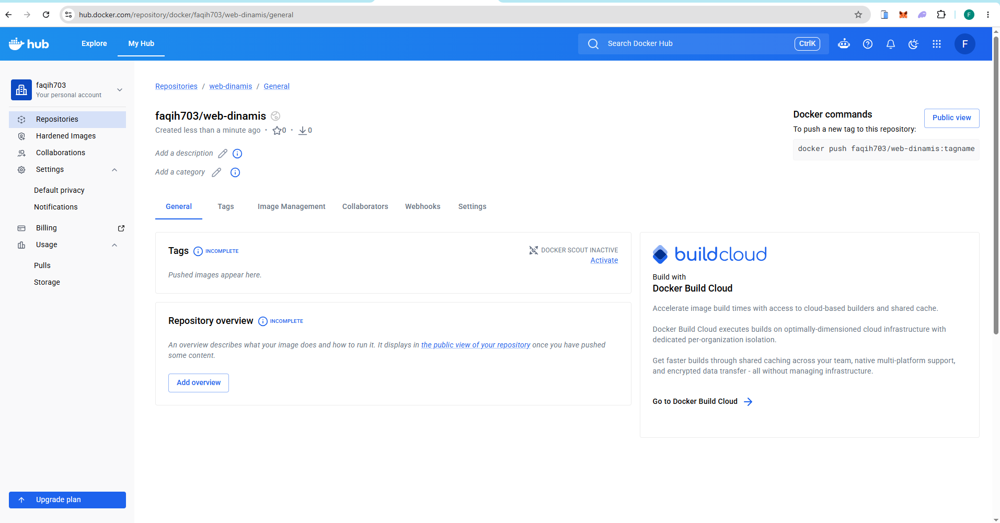
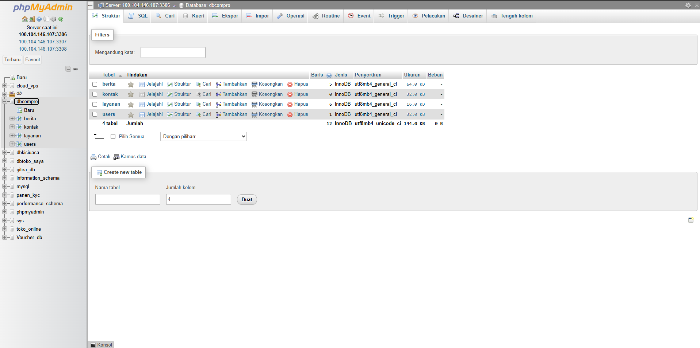
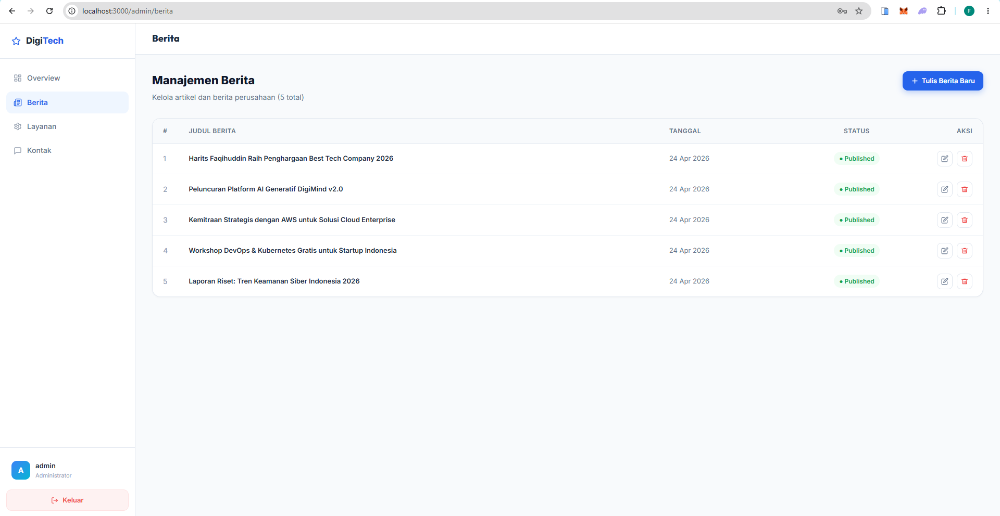
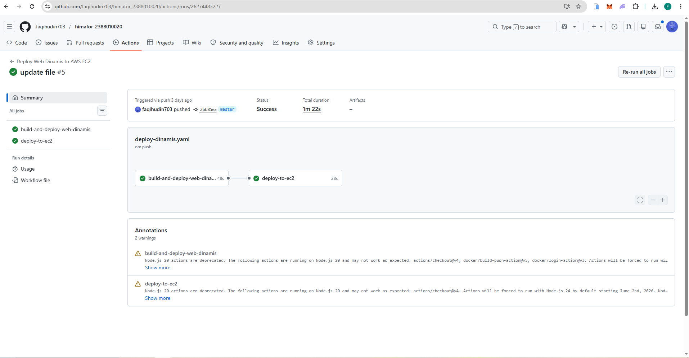
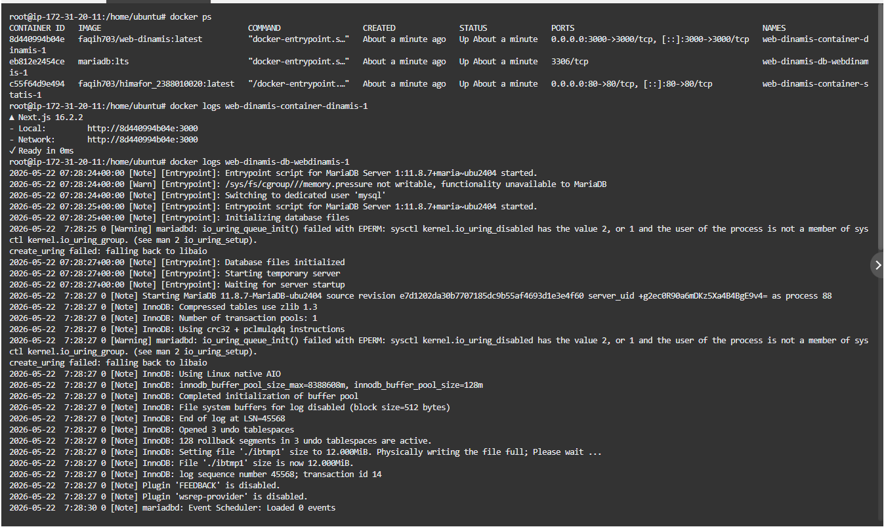
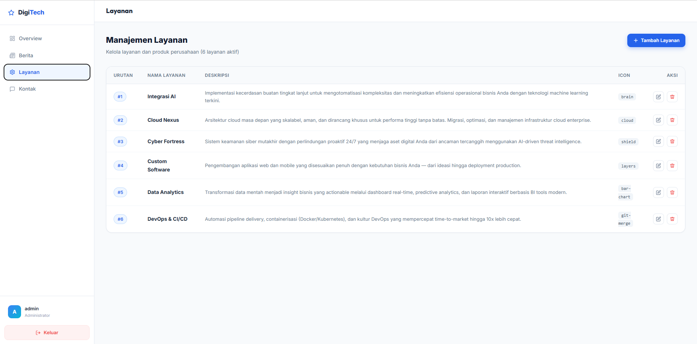

# Deploy Multiple Container menggunakan Docker Compose

1. Jalankan Instance EC2 di AWS
2. Lakukan patching pada OS
3. Hapus seluruh service yang sebelumnya diinstal secara manual
4. Buat repositori baru di Docker Hub untuk web dinamis
   
5. Buka proyek Company `himafor_nim`
6. Pisahkan proyek menjadi dua folder: satu untuk web statis, satu untuk web dinamis
7. Pindahkan file `index` dan `Dockerfile` web statis ke dalam folder `web-statis`
8. Salin folder proyek Next.JS (dari pertemuan 9) ke dalam folder `web-dinamis`
9. Uji proyek Next.JS secara lokal
   - Instal dependensi: `npm install`
   - Buat user di DBMS: `sudo mysql -u root -p`
     ```sql
     CREATE USER 'userwebdinamis_nim'@'localhost' IDENTIFIED BY 'O)xz6GWEwDOx1Ea9';
     GRANT ALL PRIVILEGES ON *.* TO 'userwebdinamis_nim'@'localhost';
     FLUSH PRIVILEGES;
     exit;
     ```
     
   - Sesuaikan file `.env` di dalam folder `web-dinamis`
   - Jalankan `npm run build` lalu `npm start`
   - Verifikasi bahwa web dapat diakses di `http://localhost:3000` tanpa error
     
10. Buat file `Dockerfile`
11. Buat file `docker-compose.yml`
12. Tambahkan file workflow `deploy-dinamis.yml` di `.github/workflows/` pada proyek `web-dinamis`
13. Perbarui file `deploy.yml` yang sudah ada di `.github/workflows/`
14. Perbarui host AWS di GitHub Secrets
15. Commit semua perubahan dari lokal
16. Push ke GitHub
17. Periksa tab Actions di GitHub — pastikan workflow berjalan dan berhasil
    
18. Cek di AWS apakah container sudah berjalan dengan benar
    
19. Akses web lewat browser, login sebagai admin, dan coba edit layanan
    

**Referensi:**
- [hhttps://github.com/faqihudin703/himafor_2388010020](https://github.com/faqihudin703/himafor_2388010020)