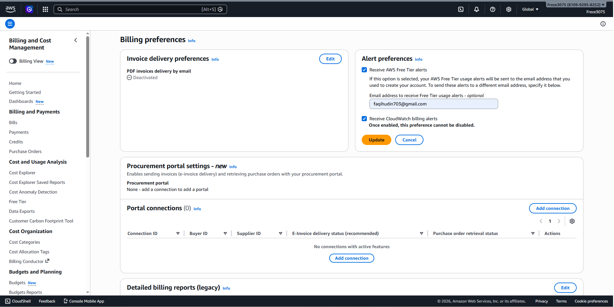
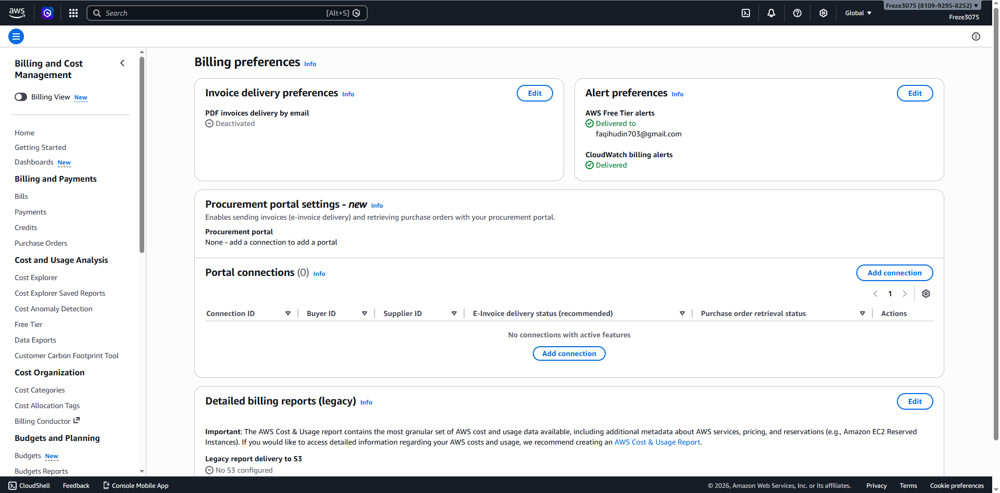
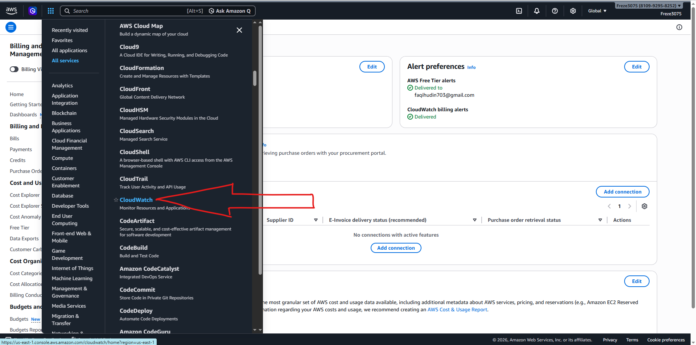
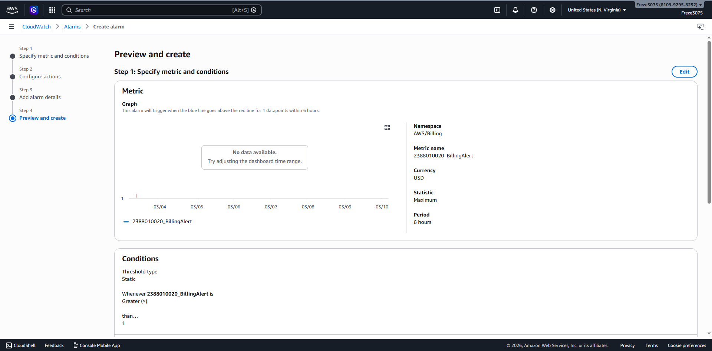
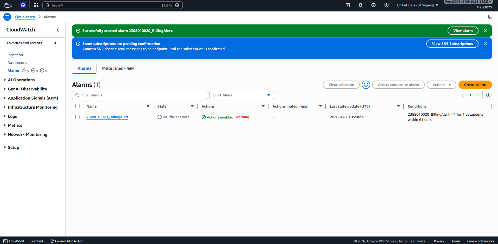

# Membuat Billing Alert di AWS untuk Mencegah Penggunaan Dana Berlebih

1. Buka Menu Dashboard AWS lalu pilih Billing Preference untuk mengaktifkan Alert
 - Masuk ke Menu Billing and Cost Management
 - Pada Menu Cost Management, scroll ke bawah dan pilih Billing Preferences
 - Pilih Menu Alert Preferences lalu klik Edit
 - Masukkan Email dan centang Receive Billing Alerts
 - Klik Update untuk menyimpan perubahan

2. Buka Menu CloudWatch melalui All Services lalu pilih CloudWatch

3. Pilih Menu Create Alarm dengan langkah-langkah berikut
 - Pastikan Region sudah berada di US East (N. Virginia)
 - Klik tombol Create Alarm
 - Klik Select Metric
 - Pilih Menu Billing
 - Pilih Menu Total Estimated Charge
 - Centang Mata Uang USD
 - Klik Select Metric
 - Beri nama Alarm: NIM_BillingAlert
 - Atur Conditions: Static → Greater than → 1 USD
 - Buat SNS Topic baru dengan nama NIM_BillingAlert lalu klik Create Topic
 - Pilih SNS Topic yang sudah dibuat: NIM_BillingAlert
 - Klik Next
 - Isi Alarm Name dengan NIM_BillingAlert
 - Klik Create Alarm
 - Buka Inbox atau Spam Email dari AWS lalu klik Confirm Subscription

