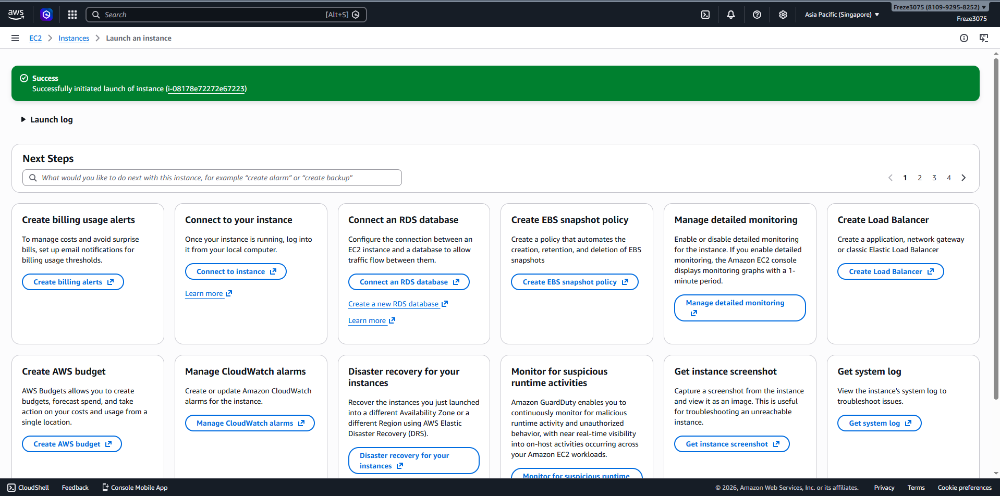
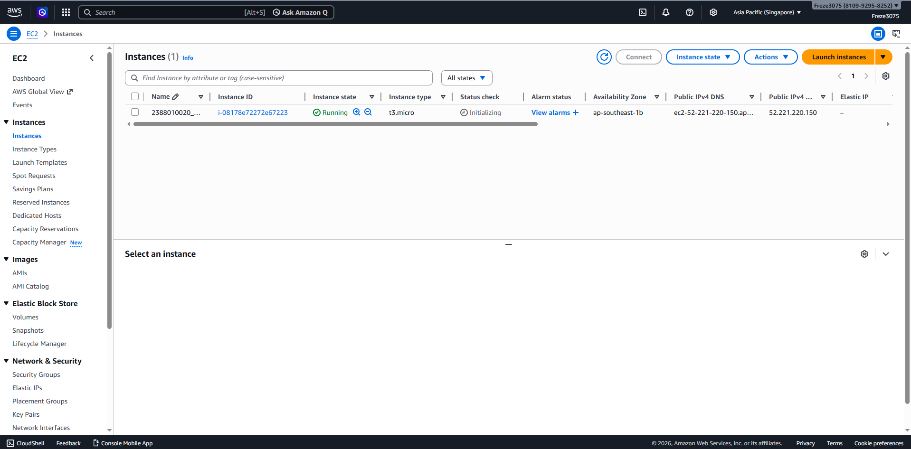

# Membuat VM / Instance di AWS EC2 dengan AMI
1. Buka Menu EC2 dari halaman Dashboard AWS
2. Klik Menu Launch Instance untuk membuat instance baru
3. Pastikan Region sudah dipilih sesuai lokasi terdekat
4. Isi Nama Instance dengan NIM_Server6A
5. Pilih OS Linux Ubuntu sebagai sistem operasi
6. Pilih Instance Type T3.Micro
7. Buat Key Pair baru dengan langkah berikut -> Klik Create new Key Pair -> Isi Nama Key Pair -> Pilih format file .Pem -> Klik Create
8. Atur Network Security Group dengan mengaktifkan opsi berikut
 - Centang Allow SSH Traffic
 - Centang Allow HTTPS Traffic
 - Centang Allow HTTP Traffic
9. Atur Storage Setting menjadi 30 GB
10. Klik Launch Instance untuk memulai pembuatan instance
11. Pastikan muncul notifikasi Success sebagai tanda instance berhasil dibuat

12. Pastikan nama instance sudah sesuai lalu klik pada nama Instance untuk melihat detailnya
