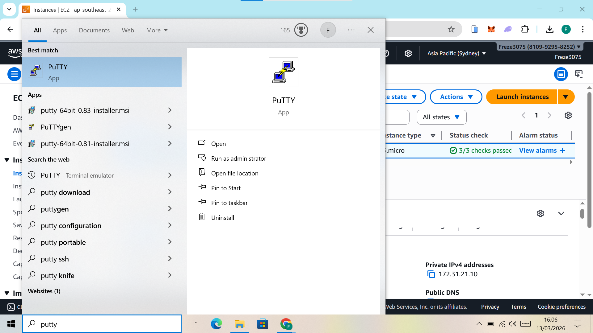
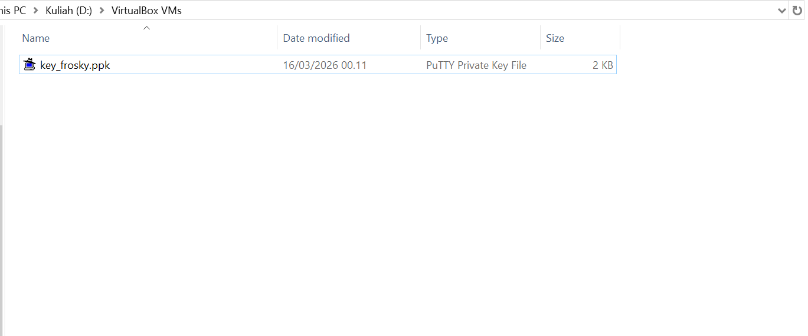
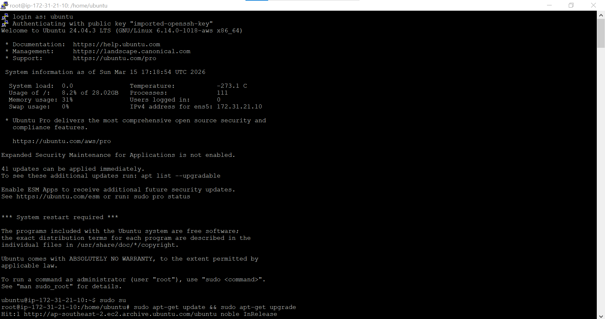
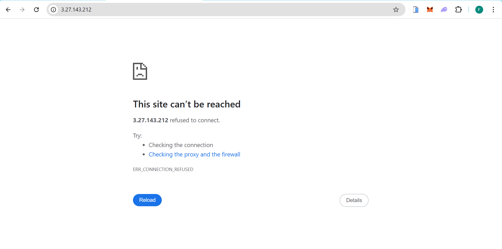
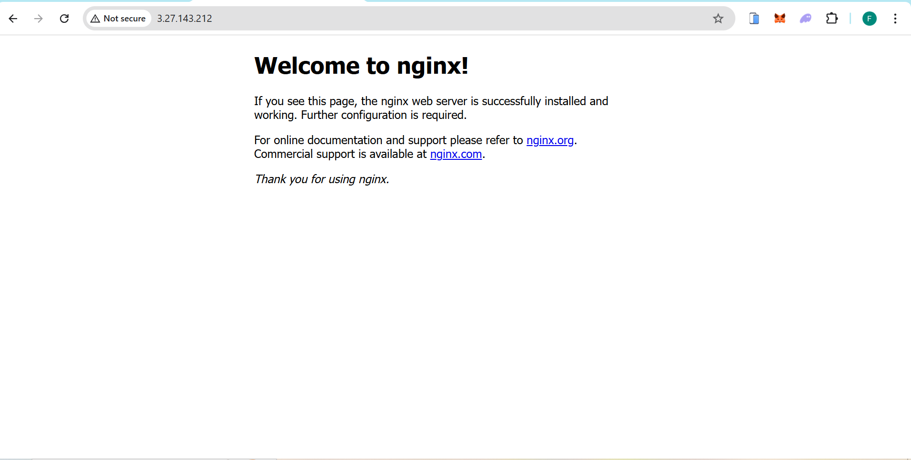

# Remote SSH dari AWS EC2 Instance

1. Download dan Install Putty di https://www.chiark.greenend.org.uk/~sgtatham/putty/latest.html

2. Konversi format Private Key dari .pem ke .ppk
    - Buka aplikasi Putty Gen
    - Load Private Key dengan ekstensi .pem 
    - Klik Save Private Key untuk menyimpan sebagai file .ppk

3. Konfigurasi Remote SSH menggunakan Putty
    - Masukkan alamat IPv4 Public sesuai instance masing-masing
    - Gunakan port SSH default (22)
    - Tambahkan private key .ppk melalui menu Connection->SSH->Auth->Credential
    - Gunakan username sesuai instance (contoh: ubuntu)

4. Setiap memulai sesi Remote, lakukan Upadte OS terlebih dahulu
 - sudo apt-get update && sudo apt-get upgrade 

5. Instalasi Web Server 
 Pastikan kondisi awal masih kosong
  
 Kemudian instal salah satu web server pilihan
 sudo apt install nginx 
 