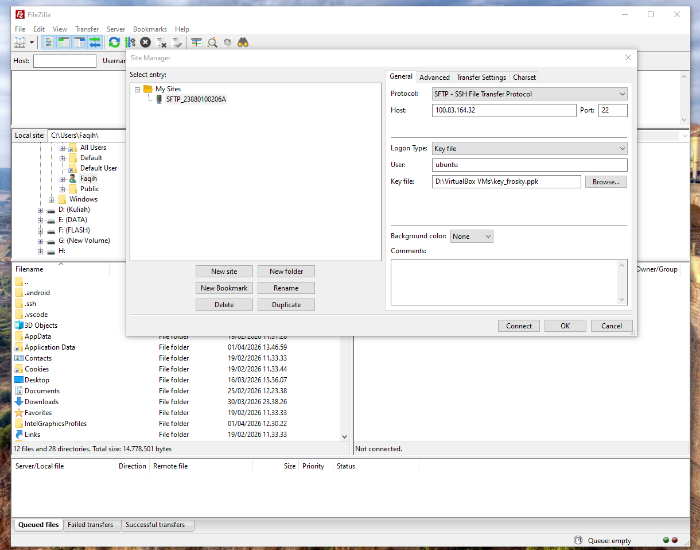
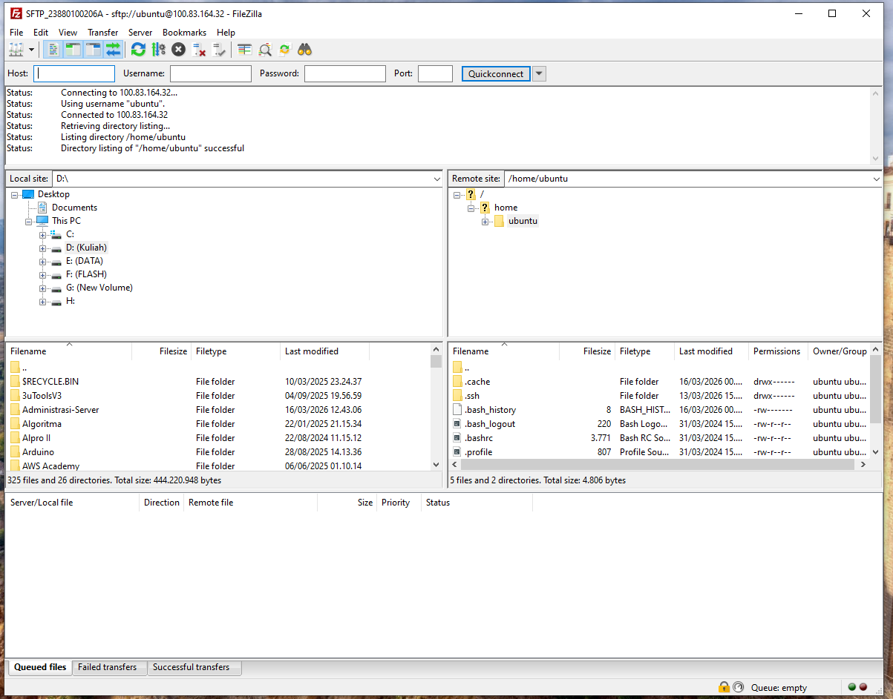
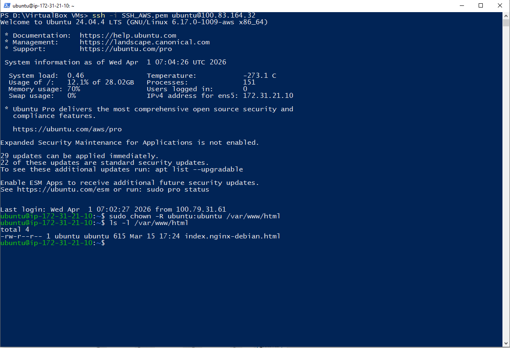
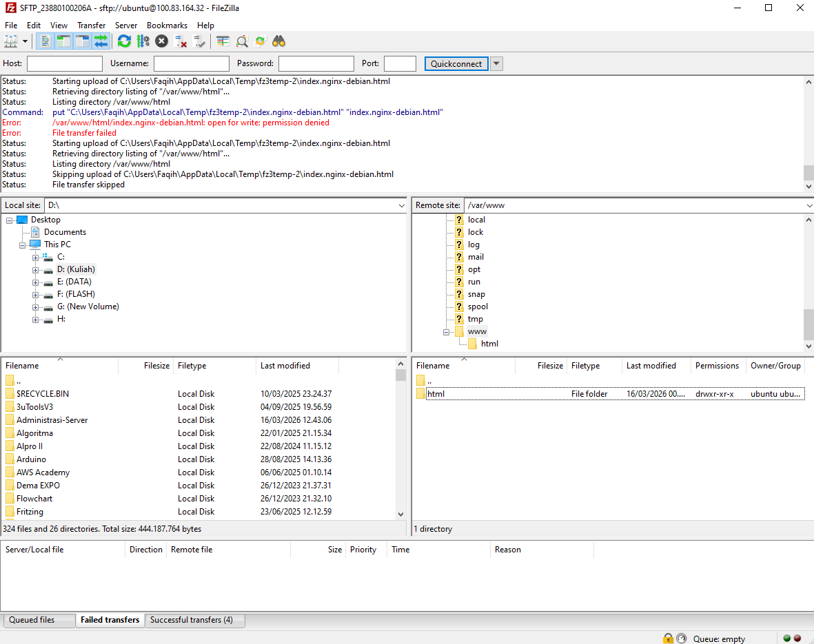
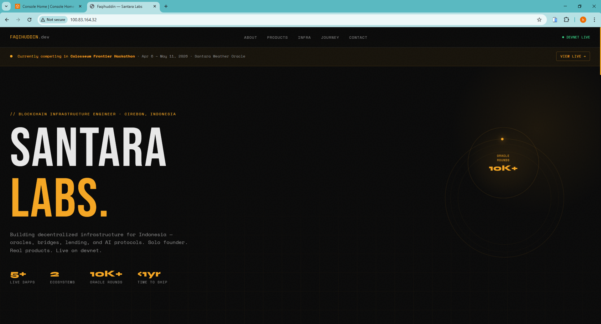
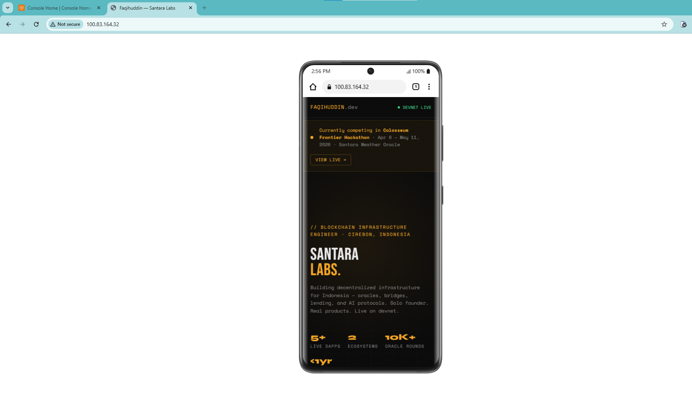

# Migrasi Data Lokal ke Cloud via SFTP dan Konfigurasi Hak Akses Web Server

1. Download dan install FileZilla melalui https://filezilla-project.org/
2. Aktifkan instance EC2 di AWS (EC2 Dashboard → Instances → Start Instance)
3. Buka FileZilla, lalu isi kredensial koneksi berikut:
    - Host: [IP_ADDRESS]
    - Username: ubuntu
    - Password: [PASSWORD]
    - Port: 22
    - Tekan tombol Quickconnect

4. Akses Server via SSH menggunakan PowerShell
    - Navigasi ke folder tempat private key tersimpan
    - Klik kanan → Open in Terminal / PowerShell
    - Jalankan perintah: `ssh -i nama-file-Private-Key.pem ubuntu@[IP_ADDRESS]`
5. Navigasi ke Direktori Web Server
    - Keluar dari direktori home (`/home/ubuntu`)
    - Pindah ke direktori `/var/www/html`
    - Coba buka file `index.html` menggunakan code editor
    - Edit akan gagal dengan pesan *Permission denied*
    - Hal ini terjadi karena user `ubuntu` belum memiliki izin write pada direktori tersebut
6. Konfigurasi Kepemilikan Direktori Web Server
    - Kembali ke terminal PowerShell
    - Jalankan perintah: `sudo chown -R ubuntu:ubuntu /var/www/html`
    - Verifikasi perubahan hak akses dengan: `ls -l /var/www/html`

7. Lakukan editing pada `index.html` setelah kepemilikan direktori berhasil diperbarui

8. Verifikasi tampilan agar bersifat Responsive di berbagai ukuran layar
