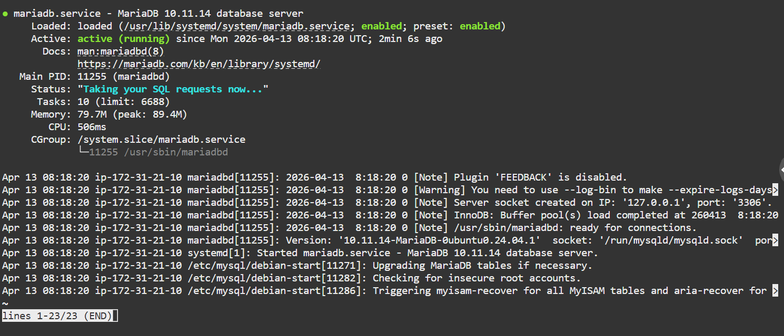
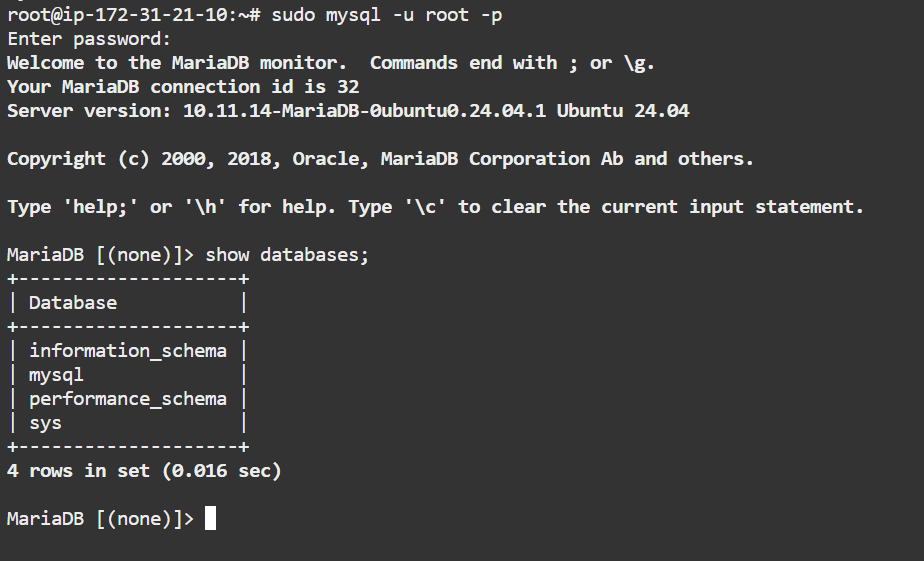
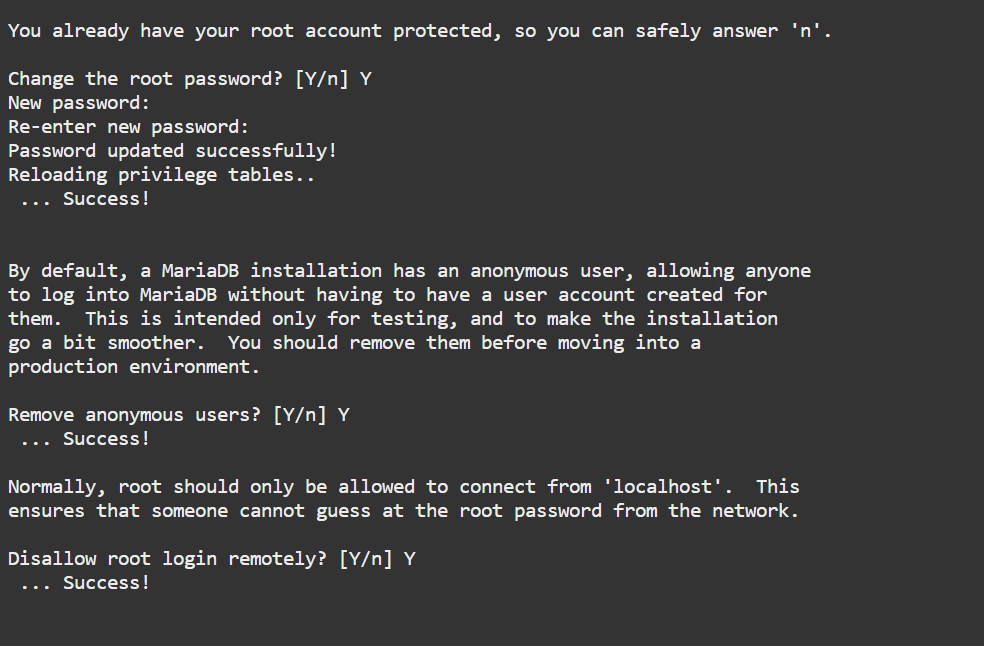
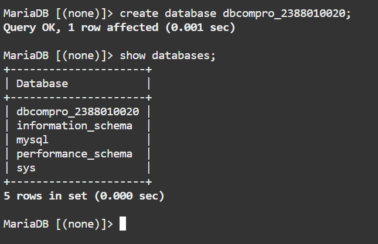
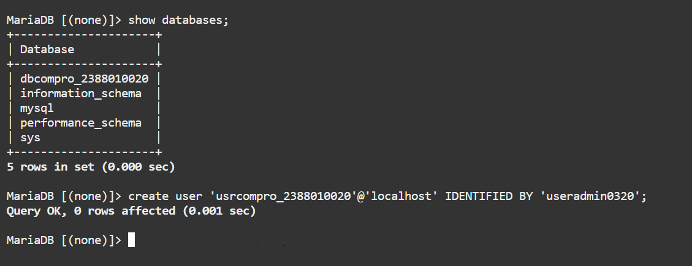
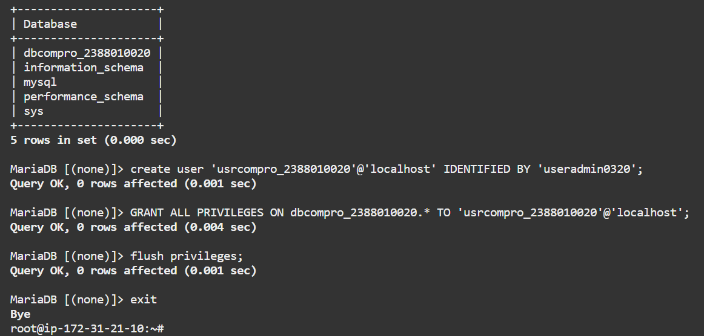
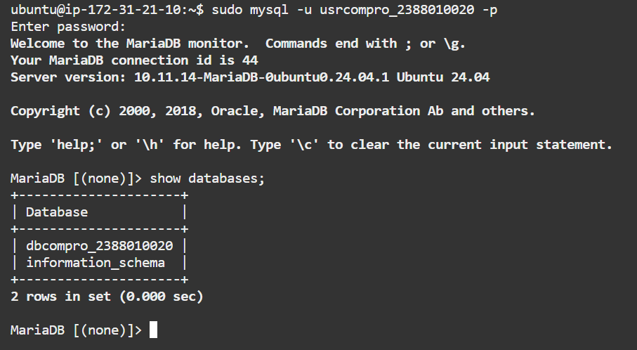

# Setting-up Database di AWS EC2 menggunakan MariaDB

## Langkah-langkah Konfigurasi

1. Aktifkan Instance AWS EC2
2. Remote Instance via OpenSSH PowerShell / PuTTY
3. Patching OS
```bash
   sudo apt-get update && sudo apt-get upgrade
```
4. Install MariaDB
```bash
   sudo apt install mariadb-server -y
```
5. Cek Status MariaDB
```bash
   systemctl status mariadb
```
   

6. Test Default Setting database server login
```bash
   sudo mysql -u root -p
```
   

7. Hardening Database Server
```bash
   sudo mysql_secure_installation
```
   - Change the password for the root user → **Y**
   - Remove anonymous users → **Y**
   - Disallow root login remotely → **Y**
   - Remove test database and access to it → **Y**
   - Reload privilege tables → **Y**

   

8. Create DB untuk Website Company Profile
   - Login sebagai root
   - Buat database baru:
```sql
     CREATE DATABASE dbcompro_NIM;
```
     
   - Buat user baru:
```sql
     CREATE USER 'usrcompro_NIM'@'localhost' IDENTIFIED BY '[PASSWORD]';
```
     
   - Grant akses ke database:
```sql
     GRANT ALL PRIVILEGES ON dbcompro_NIM.* TO 'usrcompro_NIM'@'localhost';
```
   - Terapkan perubahan:
```sql
     FLUSH PRIVILEGES;
     exit;
```
   - Login sebagai `usrcompro_NIM` dan verifikasi akses ke database yang baru dibuat

   
   