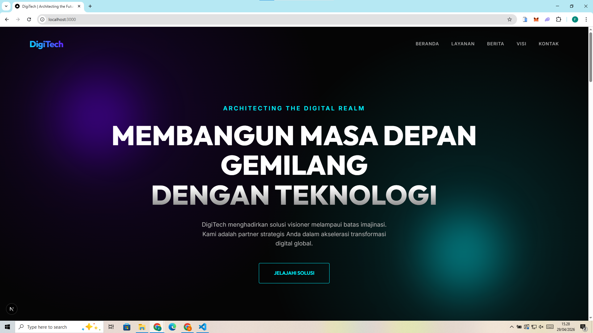
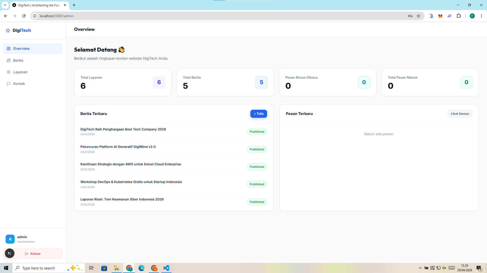
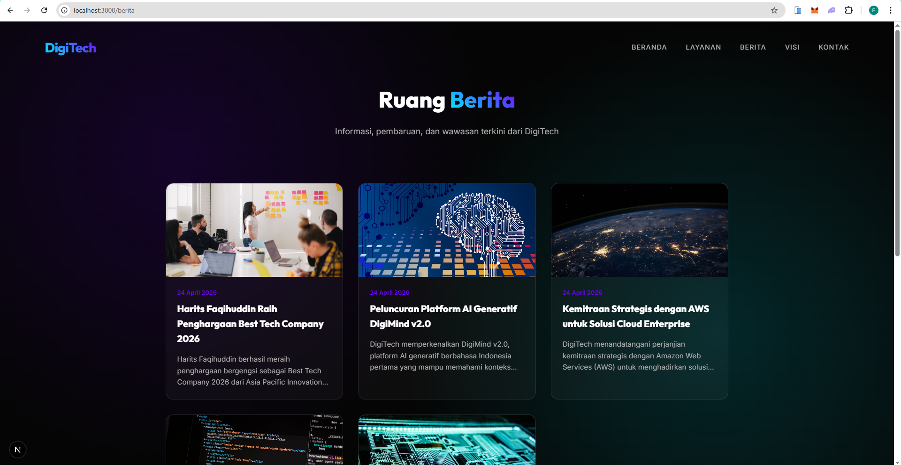
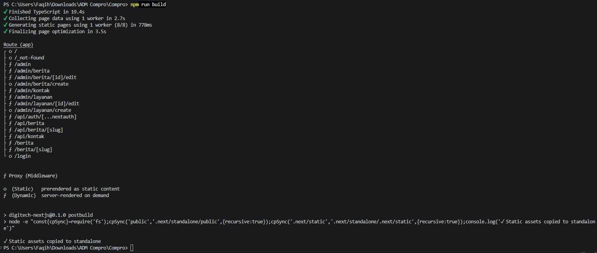
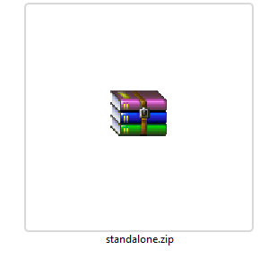
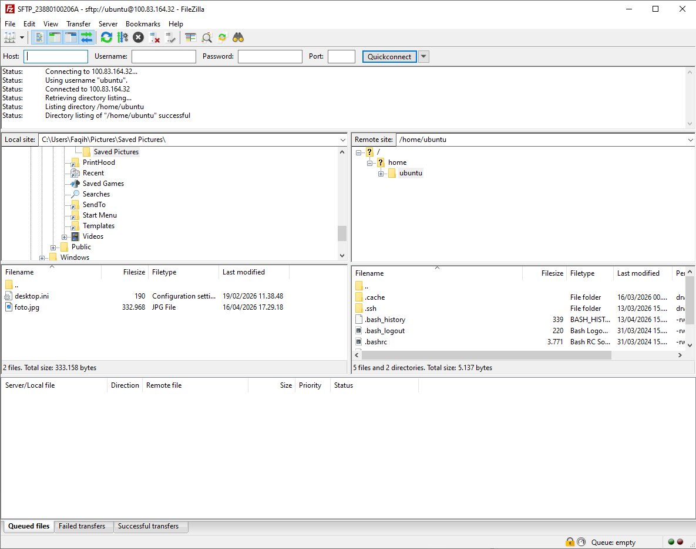
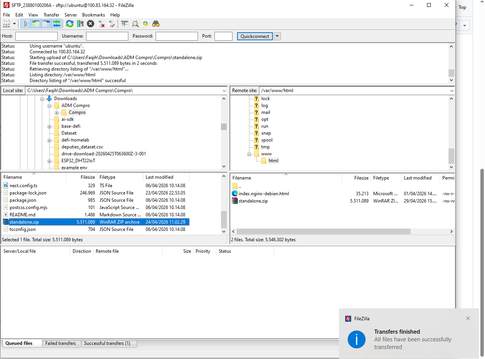

# Deploy Web Apps Framework Next.js ke AWS

## 1. Pastikan Web Apps Berjalan di Local

- Install dependensi: `npm install`
- Buat database
- Jalankan web apps: `npm run dev`
- Akses web apps di browser `http://localhost:3000`



- Testing Frontend — pastikan tampilan muncul dan tanpa error
- Testing Backend `http://localhost:3000/admin`
  ```
  Username : admin
  Password : admin123
  ```




- Buat static file: `npm run build`



- Archive folder Standalone: `zip -r standalone.zip .next/standalone`



---

## 2. Proses Deploy File ke AWS EC2

- Nyalakan instance AWS
- Connect via Terminal (SSH)
- Connect FileZilla



- Upload file `standalone.zip` beserta file HTML ke EC2

