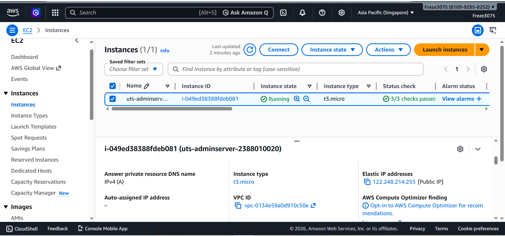
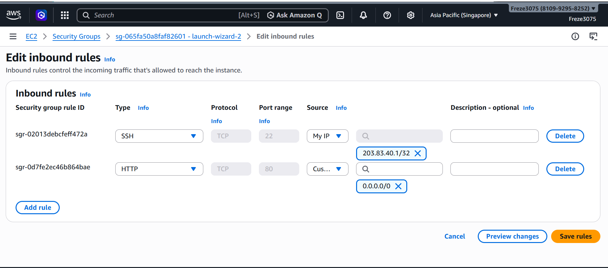
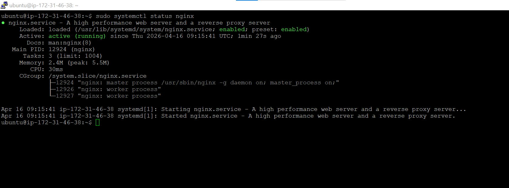
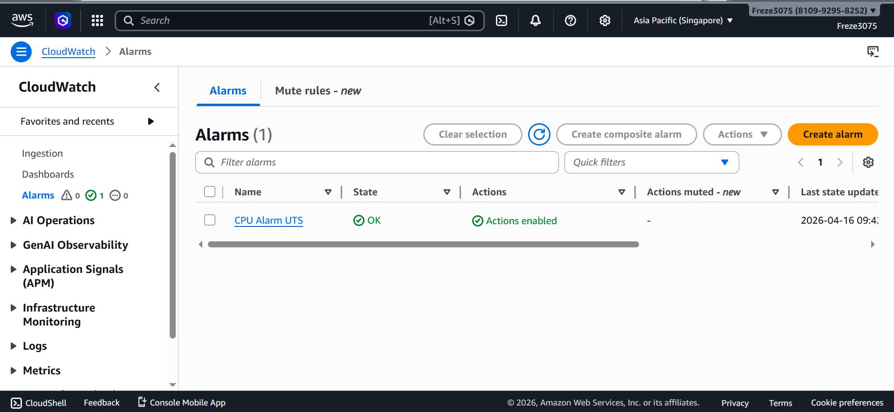

# UTS Administrasi Server

## Tahap 1 — Provisioning & Security

1. Buat instance EC2 sesuai spesifikasi.
2. Buat Elastic IP (EIP) dan Attach ke instance EC2 secara permanen.
3. Konfigurasi Security Group sesuai aturan.

## Tahap 2 — Konfigurasi Web Server

4. Lakukan remote login (SSH) ke dalam server menggunakan PuTTY atau Terminal.
5. Lakukan instalasi web server Nginx.
6. Pastikan service Nginx berstatus running dan enabled.

## Tahap 3 — Deploy Web CV

7. Siapkan source code Web CV berbasis HTML/CSS/JS.
8. Upload source code ke server menggunakan FileZilla atau WinSCP.
9. Pindahkan ke document root Nginx dan atur ownership & permissions.

## Tahap 4 — CloudWatch Alarm

10. Aktifkan Detailed CloudWatch Monitoring pada instance.
11. Buat alarm jika penggunaan CPU menyentuh >80%.

